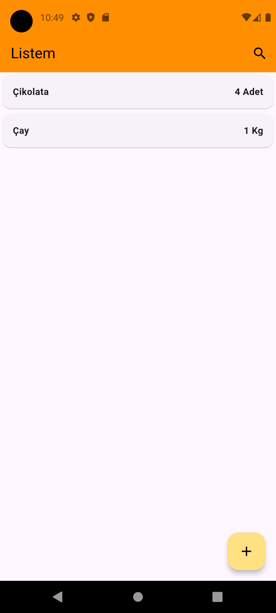
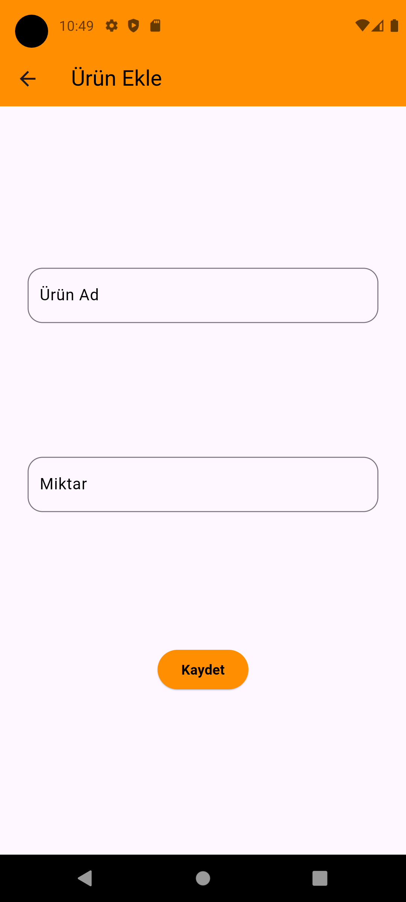
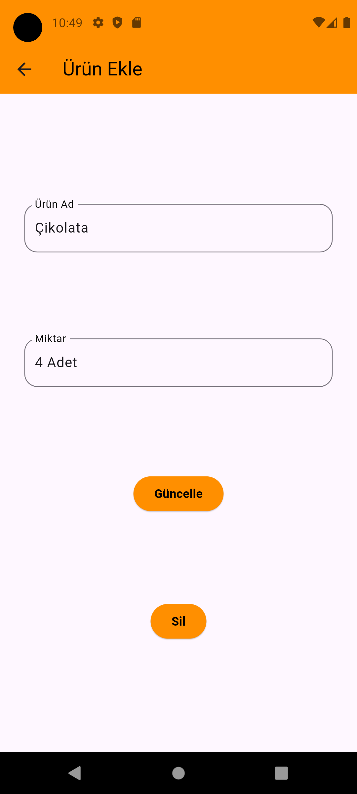

# Alışveriş Listesi Uygulaması
Bu uygulama, kullanıcıların alışveriş listesi tutmalarını kolaylaştırmak için tasarlanmıştır.

## Özellikler 
- Anasayfada alışveriş listesi görüntüleme.

- Ürünleri listeye ekleme.

- Ürünlerin adını ve miktarını güncelleme.

- Ürünleri listeden silme.

- BLoC Pattern (Cubit ve Repository) kullanımı.

- SQLite veritabanı ile veri depolama.

## Ekran Görüntüleri

## Kullanım
- Anasayfada alışveriş listesi görüntülenir.

- Herhangi bir ürüne tıklayarak detay sayfasına gidip ürünün adını ve miktarını güncelleyebilir ya da silebilirsiniz.

- Ekle butonuna basarak yeni ürünler ekleyebilirsiniz.

## Kullanılan Teknolojiler
- Flutter

- Dart

- SQLite

- BLoC Pattern

## Kurulum
1-   git clone https://github.com/kullaniciadi/alisveris-listesi.git

2-   flutter pub get

3-   Uygulamayı Çalıştırın